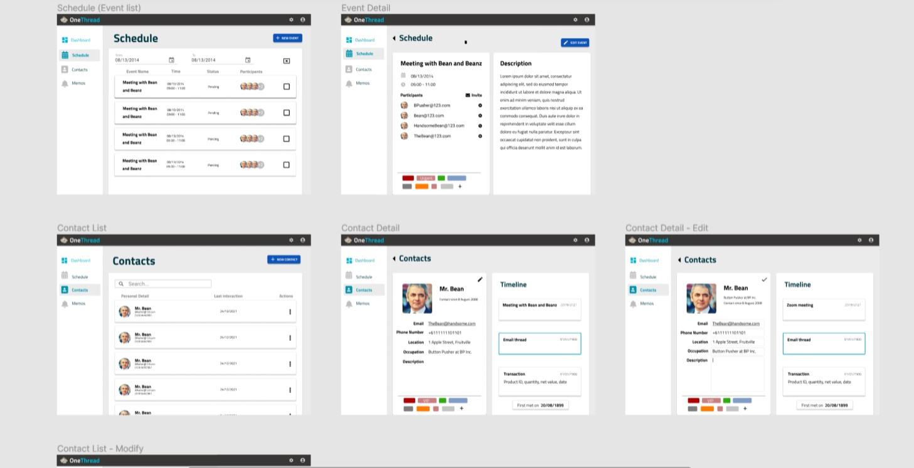
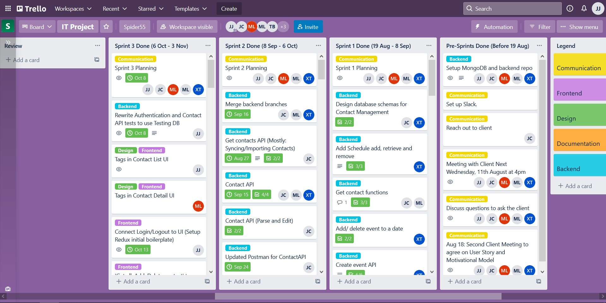
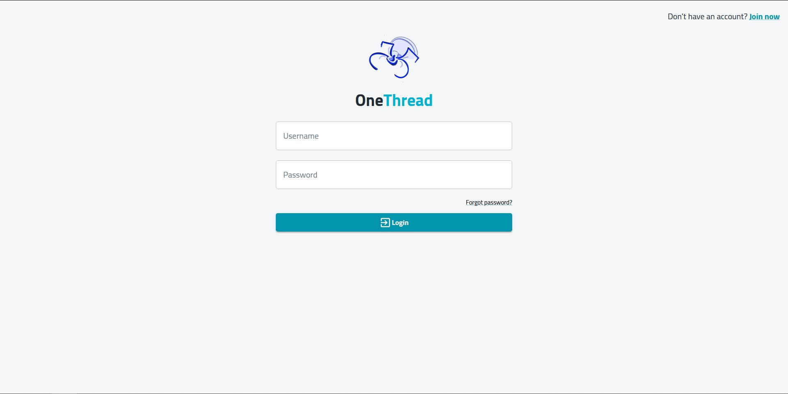
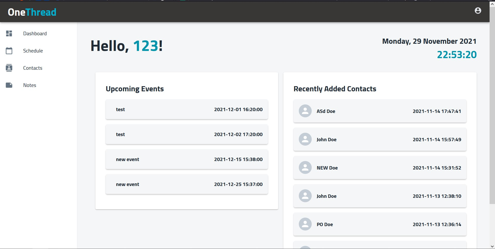
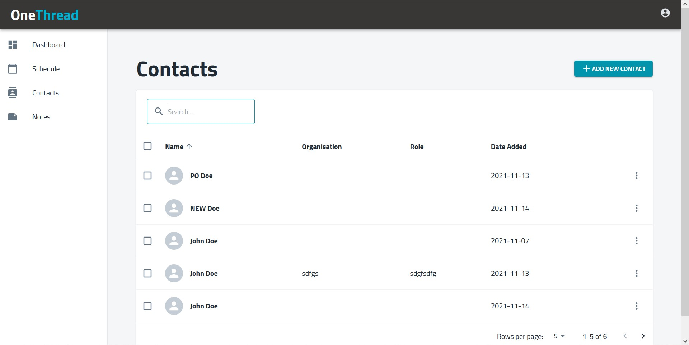
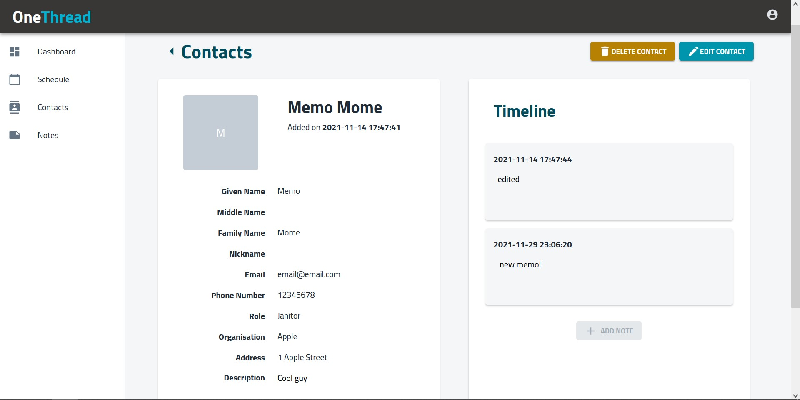
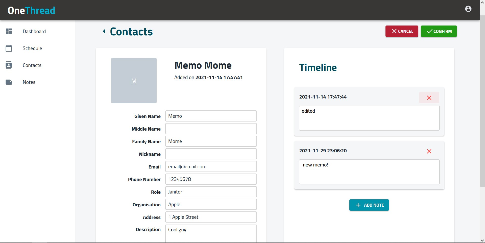
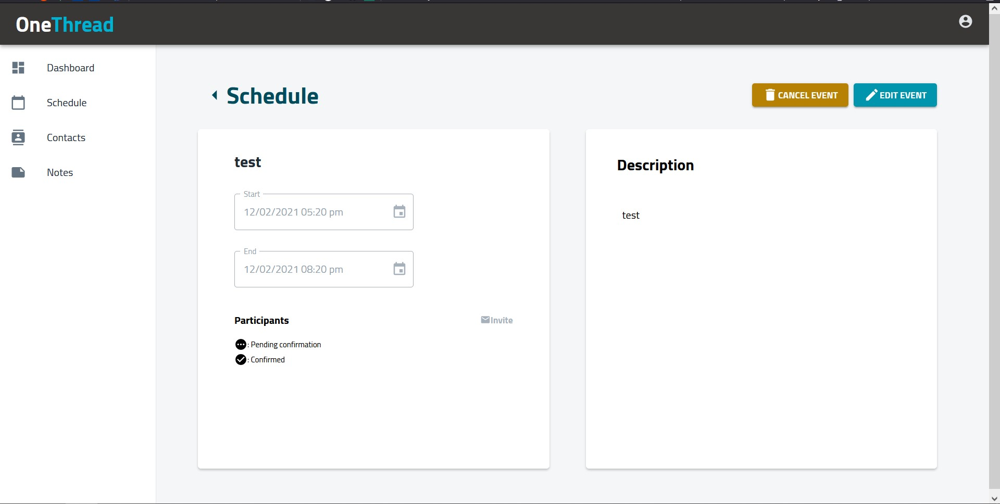

* [Live client website](https://spider55-fe.herokuapp.com)
* [Live backend server](https://spider55-api.herokuapp.com)

**OneThread** was a semester-long "capstone" project for the Computing and
Software Systems degree at Melbourne Uni, delivered in the subject COMP30022.

The focus of the subject was to give students the experience of developing a
software solution from scratch for a client, conforming to an *Agile* (!!!)
workflow. Each team would have a supervisor and a client, and have
regular meetings and work in weeks-long sprints.

The idea for this semester was "**Personal CRM**", but each team was given
full freedom in how they approached the requirement gathering, design, and
implementation for the product. Overall, one functionality common throughout
the other projects we saw -- each team had to present their project -- was
enabling a user to manage contacts and their details, like a phone book.
Basically all projects were web applications.

> Really, for my team this subject meant adapting what we knew about web
> development from a previous subject we had done together, which culminated
> in [Snacks in a Van](https://jonjauhari.com/projects/snacks-in-a-van/). Sure
> enough, this time the tutors and lecturers did not help us in any technical
> way, instead ensuring that we showed evidence of documenting APIs, meetings
> and work delegation. So much so that I suspect the final product did not
> even matter to them...

## Development Process

During development my team used Figma, Github, Zoom, Discord, Trello, and
Confluence:

I mainly worked on the client side web app that is built with React and
Redux. I also set up the automated testing and deployment of the entire
application.

## The Application

**OneThread** is live and can be accessed at the link at the top of this post.

After registering for an account and confirming via email, users can log in
securely:

The user will see the **Dashboard** page detailing events and contacts:

The **Contacts** page shows the user's contacts with pagination. Users can
filter contacts by name, sort them by the different columns, add and delete
contacts in bulk on this page.

Clicking on one contact on the list brings the user to the **Contact Detail**
page. The **Timeline** contains timestamped notes that would be used to record
the user's interactions with the contact, a simple implementation of a typical
CRM feature.

The contact's details can be edited, this includes adding, deleting and
editing notes associated with the contact. Editing contact details can be
cancelled or confirmed, making it user-friendly.

The **Schedule** page shows the user's events. Users can filter events by
date, add and delete events on this page.

Clicking on one event on the list allows the user to see its details in the
**Event Detail** page. As in **Contact Detail**, edits to the event details
can be cancelled or confirmed, making it user-friendly. The user may send
email invitations to participant's email addresses, again with confirmation.
However, this feature was not enabled in the live website due to security
issues.

The **Notes** page shows all of the user's notes. Clicking one note would
take the user to the contact page that note is associated with.

At any time the user can securely logout in the profile page accessible from
the icon on the top right.
