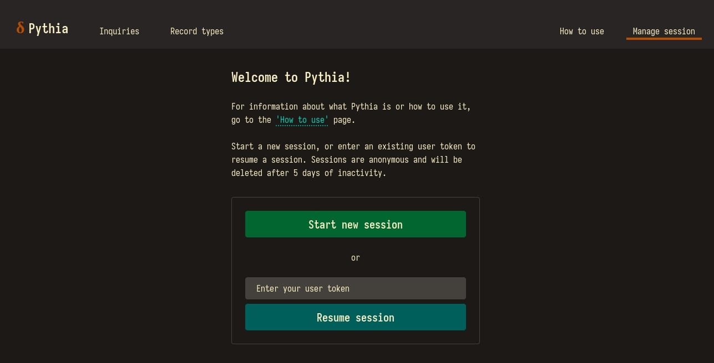
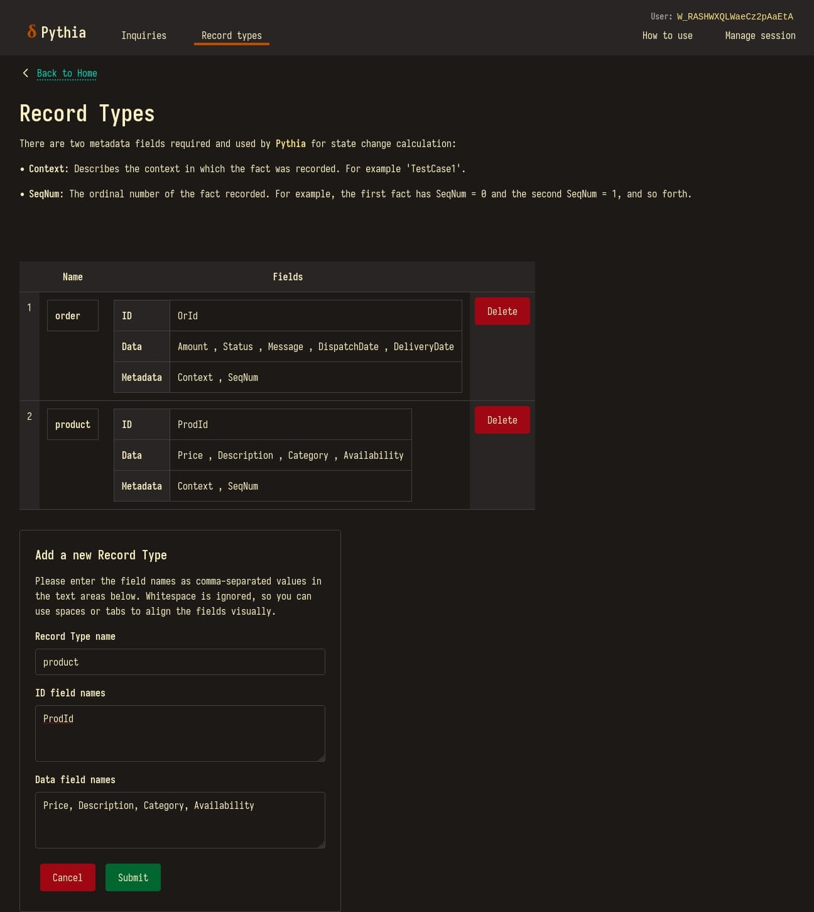
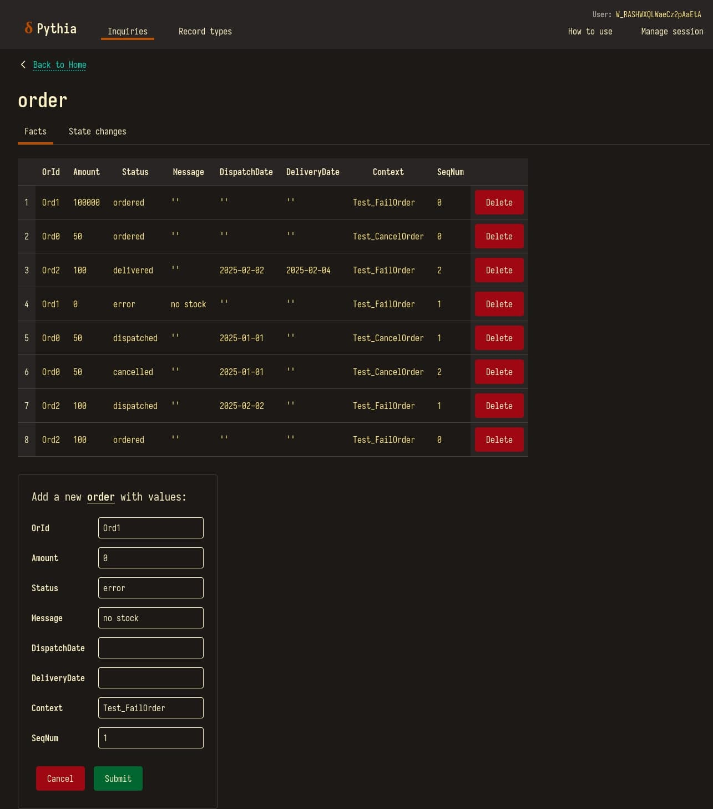
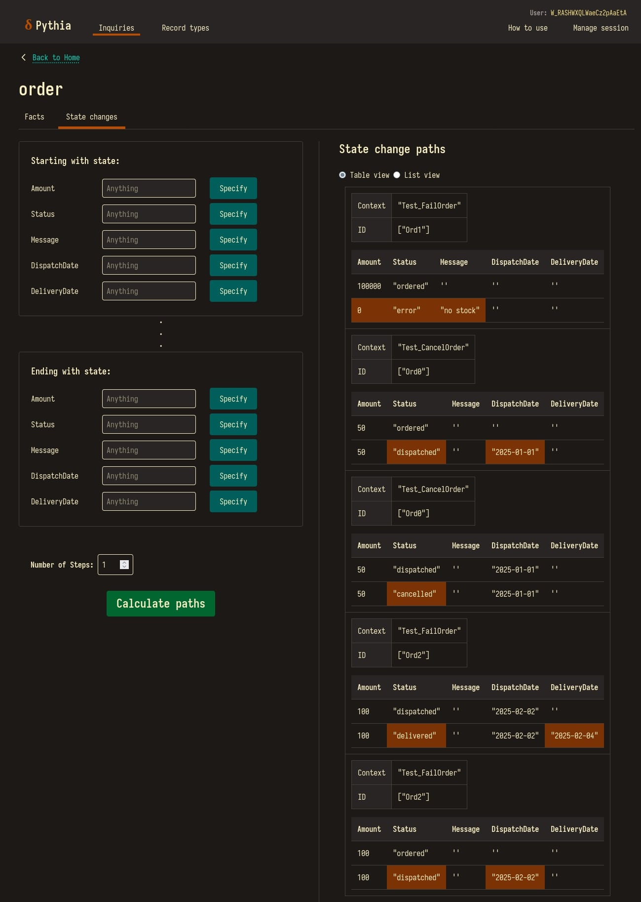
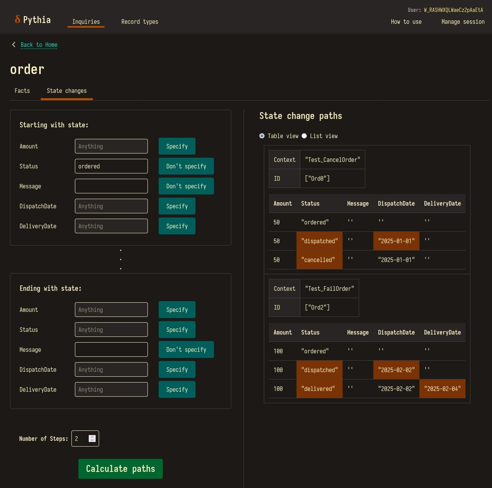

- [Github repo](https://github.com/jonjau/pythia)
- [Public demo site](https://pythia.jonjauhari.com/): I don't always keep it running to save on AWS costs — you can contact me if you'd like to see it deployed!

## The stack

Entering 2025, I had a list of technologies that I wanted hands-on experience with:

- **Rust**: my impression from Reddit is that it is the best language of all time.
- **HTMX**: I was a bit weary of thick frameworks that I see at work, and was inspired by [these blog posts on HATEOAS](https://htmx.org/essays/). Rust + HTMX is 'light' and achieves a single-page application feel.
- **Prolog**: I've always wanted to make use of Prolog's backtracking semantics in a real-world app ever since I took a subject about it at university. Lucky for me, a modern Rust-friendly implementation exists — [Scryer Prolog](https://www.scryer.pl/).
- **AWS**: After finishing my [Cloud Practitioner](https://aws.amazon.com/certification/certified-cloud-practitioner/) certificate, this is the natural next step. Specifically ECS Fargate and DynamoDB, because I will develop/deploy with Docker, and thought I might as well do without SQL entirely.
- **Terraform**: a sane and cloud-agnostic way of managing infrastructure.

Thus my tech stack was decided...

It was not trivial to learn how to actually use all these technologies, going
beyond just my rote learning. Along the way, I made good use of GitHub Copilot, and local LLMs I somehow got running on my AMD GPU.

## So what is it?

Pythia is a 'state change explorer'. It's a tool to visualise and search how records change over time, based on recorded facts for those record types. I'm not sure if there is an existing term for an application like this, maybe '[dynamic program analysis tool](en.wikipedia.org/wiki/Dynamic_program_analysis)'?

Pythia's intended use case is to aid in inferring the rules that produced the facts which are recorded.

For example, if we record to Pythia the state of a database table over the course of running unit tests, we would be able to look up how records change in the context of each unit test, and ideally make generalisations about what each unit test does, and therefore what business rules are implemented.

But, as with the prophecies of [the high priestess of Apollo in Delphi](https://en.wikipedia.org/wiki/Pythia) that this application is named after, the query results may be ambiguous, unhelpful or misleading — since test data is probably messy. Pythia is more of an exercise in seeing how [Prolog](https://en.wikipedia.org/wiki/Prolog) can be used in a user-facing web application as a substitute for SQL, and a learning experience for me.

It was also important to me that a user could use Pythia securely, but without credentials or logging in.

## How would someone use it?

Get an anonymous, temporary user token, via 'Manage session' which will set a `user_token` as a cookie.

This token is displayed at the top right of the page.

Define record types via 'Record types', or POST to the API route:
`/api/record-types` (the `user_token` cookie must be set)

Add facts for record types under 'Inquiries', or POST to the API route:
`/api/{record_type}/facts`.

Calculate state change paths under 'Inquiries' based on the recorded facts.

Narrow it down with filters, and make conclusions about the data.

In this happy path scenario, there's a few things we can loosely infer:

1. `Test_FailOrder` tests 2 unique 'order' records in total.
2. Both tests cover the mutation of `Status` from 'ordered' to 'dispatched'.
3. Starting from the `Status` of 'ordered' we can reach the `Status` of 'cancelled' or 'delivered'.
4. When the `Status` changes to 'dispatched', the `DispatchDate` is set to some date, likewise for 'delivered' and `DeliveryDate`.
5. It takes 2 steps to get from `Status` of 'ordered' to 'delivered'.
6. We could probably cancel 'Ord2' before it goes to the 'delivered' `Status`.

## Terminology

To clarify the terms used in Pythia:

- **Record type**:
    A kind of record, described by a name and list of fields of 3 types: ID, data and metadata. Analogous to a database table which has a name and a set of columns.
- **ID fields**:
    Fields that identify a particular record. If two facts have the same values for the ID fields, then both are describing the same record.
- **Data fields**:
    Fields that do not identify a particular record. These fields are the ones considered when determining state changes between records.
- **Metadata fields**:
    Fields that do not identify a record, nor are considered meaningful in state changes, but are required and used by Pythia.
- **Record**:
    An instance of a record type, in the form of a set of values corresponding to each field expected for this type. Analogous to a row in a database table describing a domain object.
- **Fact**:
    A snapshot of a record at a point in time in a certain context.
- **State**:
    A snapshot of a set of records at a point in time in a certain context. Though currently Pythia only supports single-record states.
- **State change step**:
    A transition between one state and another state at the next point in time. Can be described by a list of changed field values.
- **State change path**:
    A transition between one state and another state at some later point in time. Can be described by a list of state change steps.
- **Inquiry**:
    The act of fetching facts and state changes for a given state or record type.
- **Session**:
    An anonymous and temporary context in which Pythia is being used. Facts data is local to each session.
- **User token**:
    A string acting as an identifier for a session. It is 22 characters long.
